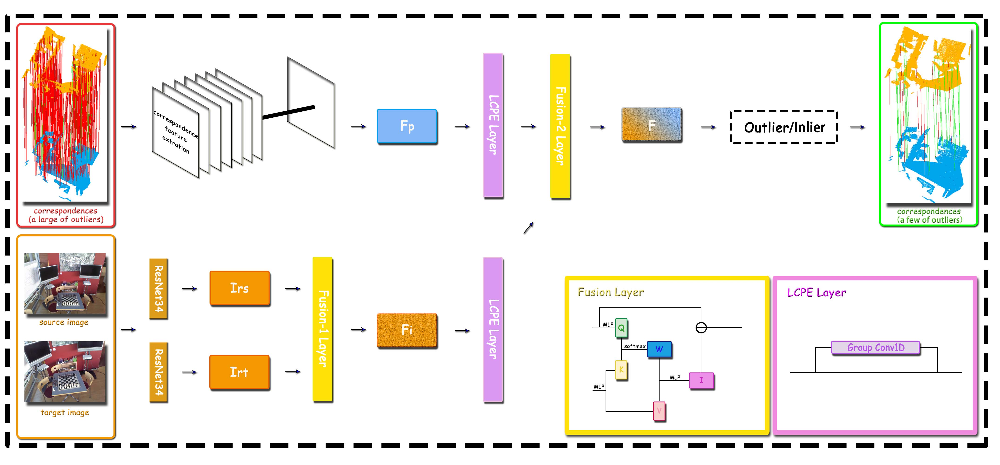

# GMF: General Multimodal Fusion Framework for Correspondence Outlier Rejection. [RAL 2022]

Rejecting correspondence outliers enables to boost the correspondence quality, which is a critical step in achieving high registration accuracy. The current state-of-the-art correspondence outlier rejection methods only utilize the structure features of the correspondences. However, texture information is critical to reject the correspondence outliers in our human vision system. With the development of point cloud technology, point cloud and RGB pairs with similar semantics have became easy to obtain, which brings an opportunity to the researches of multimodal fusion of point cloud. In this paper, we propose General Multimodal Fusion (GMF) to reject the correspondence outliers by leveraging both the structure and texture information. Specifcally, two cross-attention-based fusion layers are proposed to fuse the texture information from paired images and structure information from point correspondences. Moreover, we propose a convolutional position encoding layer to enhance the difference between T okens and enable the encoding feature pay attention to neighbor information. Our position encoding layer will make the cross-attention operation integrate both local and global information. Experiments on multiple datasets(3DMatch, 3DLoMatch, KITTI) and recent state-of-theart models (3DRegNet, DGR, PointDSC) prove that our GMF achieves wide generalization ability and consistently improves the accuracy. Furthermore, several ablation studies demonstrate the robustness of the proposed GMF on different loss functions, lighting conditions and noises.

[Paper](https://arxiv.org/pdf/2211.00207.pdf)

### The Framework of GMF

The overall of general multimodal fusion (GMF) framework. The Fp is structure feature for point correspondence that can be extracted by many recent neural networks (e.g. DGR, PointDSC). Fi is the fused texture feature by Fusion-1 layer. Then, structure feature Fp and texture feature Fi go through a local convolutional position encoding layer and then pass to Fusion-2 layer to get the fnal correspondence feature. This feature is then utilized to classify as outlier/inlier.

|      The Overall Framework    | 
|:-----------------------------:|
|       |

Please refer to our [paper](https://arxiv.org/pdf/2211.00207.pdf) for more details.

## Requirements

- Ubuntu 18.04.1 or higher
- CUDA 11.1 or higher
- Python v3.6 or higher
- Pytorch v1.8 or higher
- [MinkowskiEngine](https://github.com/stanfordvl/MinkowskiEngine) v0.5 or higher


## Dataset Download

Regarding the 3DMatch and 3DLoMatch, the images are selected for each point cloud based on their covered content to construct a dataset of paired images and point clouds named 3DImageMatch. 
Download the [3DImageMatch/Kitti](https://pan.baidu.com/s/1GMYBth0fhid3IbbUJ0w1-Q) . The code is p2gl.
For [PointDSC](https://github.com/XuyangBai/PointDSC) and [DGR](https://github.com/chrischoy/DeepGlobalRegistration) dataset, please refer to their github.

Please concat the files
```
# 3DImageMatch
cat x00 x01 ... x17 > 3DImageMatch
# Kitti
cat Kitti01 ... Kitti10 > Kitti
```

## Training PointDSC

Train the PointDSC on 3DMatch with GMF

```
cd GMF_PointDSC
python train_3DMatch.py
```

Train the PointDSC on Kitti with GMF

```
python train_KITTI.py
```

## Training DGR

Train the DGR on DGR with GMF

```
cd GMF_DeepGlobalRegistration/GMF_DeepGlobalRegistration_fcgf
python train_3DMatch.py
```

Train the DGR on Kitti with GMF

```
cd GMF_DeepGlobalRegistration/GMF_DeepGlobalRegistration_fcgf
python train_Kitti.py
```

## Evaluating PointDSC

Evaluating the 3DMatch

```
cd GMF_PointDSC/evaluation
python test_3DMatch.py
```

Evaluating the Kitti

```
cd GMF_PointDSC/evaluation
python test_KITTI.py
```

## Evaluating DGR

Evaluating the 3DMatch

```
cd GMF_DeepGlobalRegistration/GMF_DeepGlobalRegistration_fcgf/scripts
python test_3DMatch.py
```

Evaluating the Kitti

```
cd GMF_DeepGlobalRegistration/GMF_DeepGlobalRegistration_fcgf/scripts
python test_kitti.py
```

## Pretrained Modal

|   DGR                     | PointDSC                     |
|:-------------------------------:|:----------------------------:|
|  [3DMatch/FCGF(93.28%)](https://drive.google.com/file/d/1TYOiFrsvB4JIRAwnZlldO7NJfNdCthNl/view?usp=share_link)        | [3DMatch/FCGF(93.53%)](https://drive.google.com/file/d/1KZKilenFyPdO6DWmMziFVwwPzMoZjSBX/view?usp=share_link)     |
|  [3DMatch/FPFH(77.53%)](https://drive.google.com/file/d/1aBRdkIy1NWi-yNsU1i6v90jT49YutURQ/view?usp=share_link)        | [3DMatch/FPFH(81.45%)](https://drive.google.com/file/d/1jqhA4D58GSAzCecig0wvfQ-IWyotB8wM/view?usp=share_link)     |
|  [Kitti/FCGF(98.73%)](https://drive.google.com/file/d/1FlFlJlffhhz2fP2KVKSMfRH7Z6YrDkAB/view?usp=share_link)        | [Kitti/FCGF(98.38%)](https://drive.google.com/file/d/11c5XtQDACirBRBelLTbTQnM1Wy23pTxn/view?usp=share_link)     |


## Citing our work

Please cite the following papers if you use our code:

```latex
@article{huang2022gmf,
  title={GMF: General Multimodal Fusion Framework for Correspondence Outlier Rejection},
  author={Xiaoshui Huang, Wentao Qu, Yifan Zuo, Yuming Fang and Xiaowei Zhao},
  journal={IEEE Robotics and Automation Letters},
  volume={7},
  number={4},
  pages={12585--12592},
  year={2022},
  publisher={IEEE}
}
```
